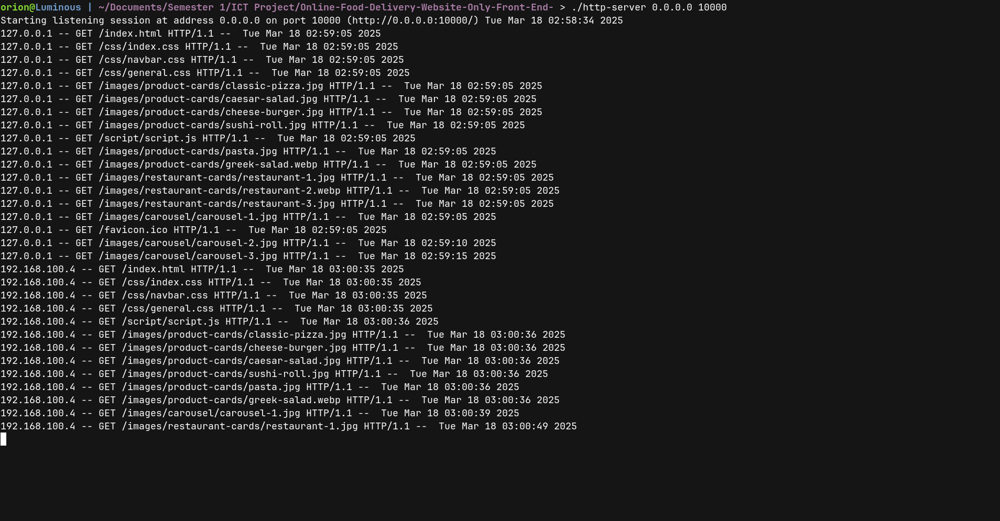
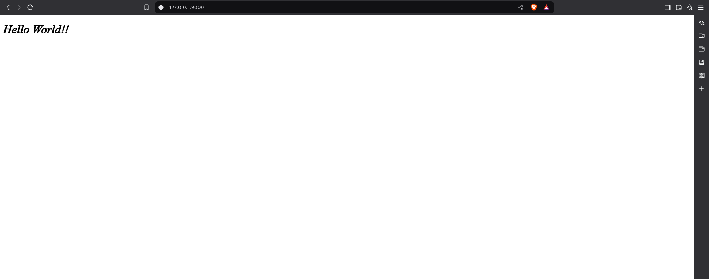

# HTTP-Server

Using C++ to make a HTTP server from scratch

Screenshots:

# 1. Scope of this Project:
1. Basic server
2. Static File Serving
3. Server configuration through files
4. Logger

If I have extra time then I will also do:
1. Implement HTTPS for security
2. Implement Asynchronous I/O
3. Basic GUI