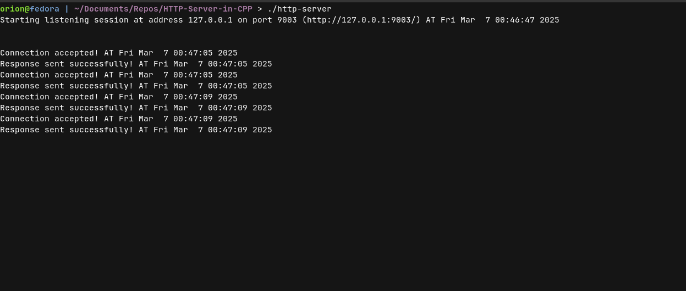

# HTTP Server

A simple HTTP server built from scratch using C++.

## **Screenshots**
  
  

---

## **1. Scope of This Project**
### ✅ Core Features:
- Basic server functionality  
- Static file serving  
- Server configuration through external files  
- Logging system  

### 🔜 Future Enhancements (If Time Allows):
- Implement **HTTPS** for security  
- Implement **Asynchronous I/O** for better performance  
- Build a **basic GUI** for server management  

---

### 🚀 **How to Run the Server**
```sh
# Compile the server
g++ -o server src/main.cpp

# Run the server
./server
